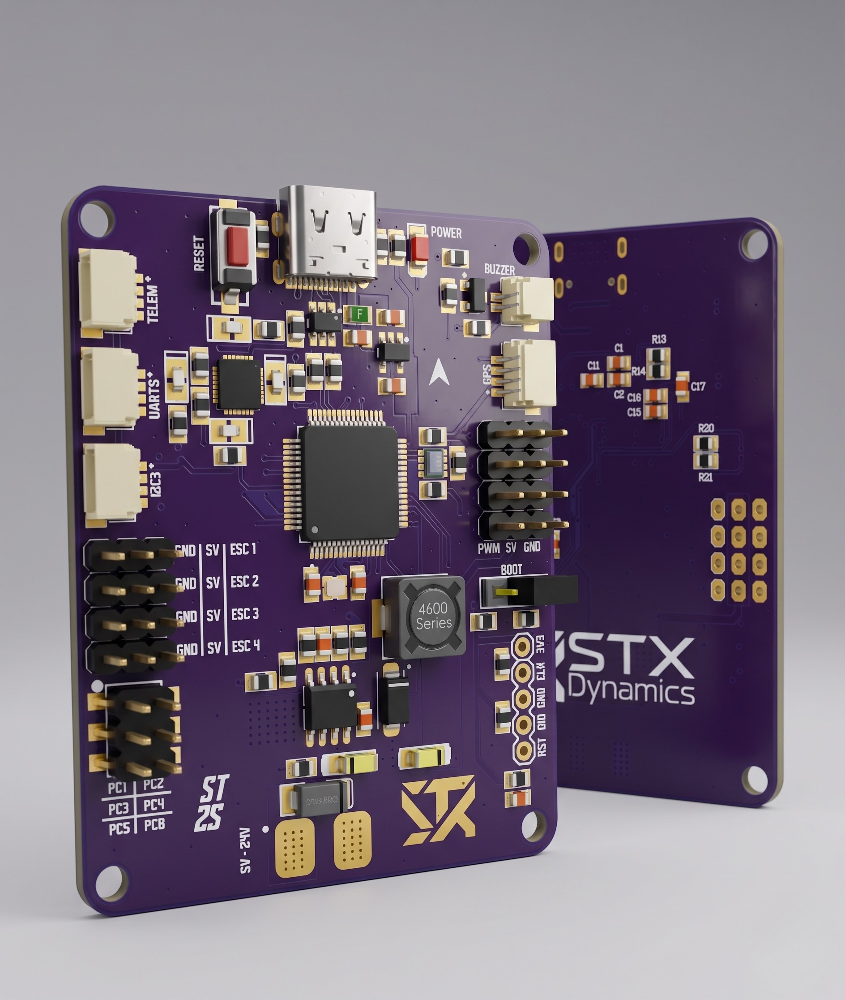

<div align="center">

# STX Dynamics — F405 Flight Controller

**Model:** STX-FC-405-R1 · **Part No:** `SXFC405A`

A compact STM32F405-based flight controller for multirotor and RC aircraft, with an onboard
9-axis IMU, barometer, EEPROM, USB-C, and a full set of UART, I²C, ESC, and servo I/O.

<!-- Replace the badge values below once you've set up the repo / releases / license -->


</div>



---

## Overview

The **STX-FC-405** is a flight controller built around the **STMicroelectronics STM32F405RG**
microcontroller, paired with an **MPU-9250** 9-axis IMU and a **BMP280** barometric
pressure/temperature sensor for attitude and altitude estimation. An onboard **25LC1024** SPI
EEPROM provides non-volatile storage, and a **USB Type-C** port (with ESD and over-current
protection) handles configuration and firmware flashing.

Power is handled by dual **MP1584EN** step-down regulators (5 V and 5.4 V rails) plus an
**NCP718** LDO for the 3.3 V logic rail, accepting a **2S–5S** battery input. The board exposes
four ESC outputs, four servo outputs, and dedicated UART connectors for GPS, telemetry, and
user peripherals.

The STM32F405 + MPU-9250 + BMP280 combination is a widely used target for common open-source
flight firmware. **Confirm and list the specific supported firmware before publishing.**


---

## Key Features

- **STM32F405RG** MCU (Cortex-M4, 168 MHz class) with an 8 MHz external crystal
- **MPU-9250** 9-axis IMU (gyro + accelerometer + magnetometer) on I²C
- **BMP280** barometric pressure / temperature sensor on a separate I²C bus
- **25LC1024** 1 Mbit SPI EEPROM for configuration/blackbox-style storage
- **USB Type-C** with **USBLC6-2** ESD protection and a 500 mA resettable over-current fuse
- **Onboard power supply:** dual MP1584EN bucks (5 V / 5.4 V) + NCP718 3.3 V LDO
- **2S–5S** battery input
- **4× ESC outputs** and **4× servo (PWM) outputs**
- Dedicated **GPS**, **telemetry**, and **user UART** connectors, plus a **user I²C** port
- **SWD** debug/programming header and **BOOT** jumper
- **Status LEDs** (red/green/blue/yellow), red power LED, and a buzzer driver
- **GPIO breakout** header (PC1–PC8)

---

## Specifications

| Parameter | Value |
|---|---|
| MCU | STMicroelectronics STM32F405RG (LQFP-64) |
| IMU | InvenSense MPU-9250 (9-axis) |
| Barometer | Bosch BMP280 (pressure + temperature) |
| EEPROM | Microchip 25LC1024 (1 Mbit SPI) |
| Crystal | 8 MHz |
| USB | USB Type-C (config + flashing) |
| USB protection | USBLC6-2 ESD + 500 mA fuse |
| Battery input | 2S–5S Li-ion / LiPo |
| Input voltage | ≈ 8–24 V (schematic); board silkscreen marked 5–24 V |
| Regulators | 2× MP1584EN buck (5 V, 5.4 V) + NCP718 LDO (3.3 V) |
| Motor outputs | 4× ESC (PWM) |
| Servo outputs | 4× servo (PWM) |
| UARTs | GPS, Telemetry, User UART |
| I²C | User I²C port (plus internal sensor buses) |
| Debug | SWD header (RST / DIO / GND / CLK / 3V3) |
| Dimensions (L × W) | **65x45** mm |
| Mounting pattern | **M3** |
| Weight | **27** g |

> Input-voltage figures reflect the schematic note (8–24 V) versus the board silkscreen (5–24 V) —
> confirm the validated range before publishing.

---

## Connectors & I/O

| Connector | Interface | Notes |
|---|---|---|
| USB-C | USB | Configuration, firmware flashing, power |
| `GPS` | UART | GPS module |
| `TELEM` | UART | Telemetry radio |
| `UART` (user) | UART | Spare serial peripheral |
| `I2C3` (user) | I²C | External I²C peripherals |
| `ESC 1–4` | PWM | Motor ESC signal outputs (with 5 V / GND) |
| `PWM` (servo 1–4) | PWM | Servo outputs (5 V / signal / GND) |
| SWD header | SWD | `RST` / `DIO` / `GND` / `CLK` / `3V3` |
| GPIO header | GPIO | PC1–PC8 breakout (2×3) |
| `BOOT` | — | Boot-mode jumper |
| `Buzzer` | — | Buzzer output |

> UART connectors use a JST-GH-style footprint (PRT-14417). Confirm exact pinouts against the
> board before publishing a wiring guide.

---

## Bill of Materials (key components)

| Ref | Component | Part | Function |
|---|---|---|---|
| U1 | MCU | STM32F405RG | Main processor |
| U3 | IMU | MPU-9250 | 9-axis motion sensor |
| U2 | Barometer | BMP280 | Pressure / temperature |
| U4 | EEPROM | 25LC1024 | 1 Mbit SPI storage |
| U6 | LDO | NCP718 | 3.3 V regulator |
| U7 / U?? | Buck regulators | MP1584EN ×2 | 5 V / 5.4 V rails |
| U5 | USB ESD | USBLC6-2 | USB-C protection |
| Q1 | Transistor | BC817 | Buzzer driver |
| D6 | LED | Red | Power indicator |

> A full BOM (`BOM.csv`) with all passives is recommended in the repo root or `/hardware`.
> Designations follow the project schematics (Rev V1.0).

---

## Getting Started

1. **Connect via USB-C** to configure the board and flash firmware.
2. **Mount** the board to your frame, isolating it from conductive surfaces.
3. **Wire ESCs** to the `ESC 1–4` outputs and servos to the `PWM` outputs, observing signal/5V/GND order.
4. **Connect peripherals** — GPS, telemetry radio, and any I²C/UART devices — to their labelled ports.
5. **Power** the board from a 2S–5S battery on the power input, observing correct polarity.
6. **Verify** the 3.3 V and 5 V rails and confirm the power LED before arming.

### Notes

- Do not exceed the rated battery input; confirm your pack voltage against the board's input range.
- Use the `BOOT` jumper and SWD header for low-level/recovery flashing if needed.
- Keep IMU-area mounting rigid and vibration-damped for clean sensor data.

---

## Product Numbering

STX Dynamics products use a dual identifier: a **human-readable** code and a **compact** code
etched on the hardware. Both encode the same fields. The third field is each family's primary
differentiator — **max current** for PDBs, **MCU series** for flight controllers.

| Field | Readable | Compact |
|---|---|---|
| Company | `STX` | `SX` |
| Family | `FC` | `FC` |
| Differentiator (MCU series) | `405` | `405` |
| Revision | `R1` | `A` |

**This product:** `STX-FC-405-R1` ⇄ `SXFC405A`

Compact format: `SX` + family token + 3-char differentiator + revision letter (`A` = R1, `B` = R2, …).

**Catalog so far:** `SXPDB080A` (PDB, 80 A) · `SXPDB160A` (PDB, 160 A) · `SXFC405A` (FC, STM32F405)

---

## Repository Structure

```
.
├── README.md            # This file
├── LICENSE              # TODO: choose a license
├── CHANGELOG.md         # Revision history
├── hardware/            # Schematics, board files, gerbers
│   ├── schematic.pdf
│   └── BOM.csv
├── firmware/            # Firmware / target config (if applicable)
└── docs/
    └── images/          # Board photos, pinout, diagrams
```

<!-- Adjust to match how you actually organize the repo. -->

---

## Documentation

- 📄 Schematic (Rev V1.0) — **add to `/hardware`**
- 🔌 Pinout / wiring guide — **-**
- 💾 Supported firmware & flashing guide — **-**

---

## Revision History

| Revision | Part No. | Date | Notes |
|---|---|---|---|
| R1 (V1.0) | `SXFC405A` | **2025** | Initial release |

---

## Contributing

Issues and pull requests are welcome. For hardware change requests, please open an issue
describing the proposed change and the use case.

---

## License

**-** — choose and add a license (e.g. CERN-OHL for open hardware, or a proprietary notice).

---

## Credits & Contact

- **Company:** STX Dynamics
- **Hardware design:** Arif Mandal *(per schematic title block — update as needed)*
- **Email:** **stuncdemir0@gmail.com**
- **Website:** **stxdynamics.com**

---

<div align="center">

© STX Dynamics. All rights reserved.

</div>
